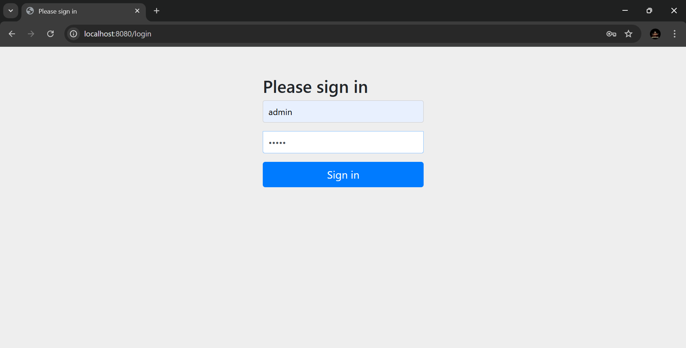

# Personal Blog

##### Solution for the [Personal Blog](https://roadmap.sh/projects/personal-blog) backend project from [roadmap](https://roadmap.sh/).
[](https://roadmap.sh/)

**Description:**

This Spring Boot application provides a user-friendly web interface for a personal blog where one can write and publish articles. The blog has two sections: a guest section and an admin section.

- **Guest Section** — A list of pages that can be accessed by anyone: home page, list of articles, and article page.
- **Admin Section** — An admin page for performing basic CRUD operations with the articles. It uses basic Spring Security authentication.

**Prerequisites:**

-   **Java 11 or above:** Download and install Java from the official website ([https://www.oracle.com/java/technologies/javase-downloads.html](https://www.oracle.com/java/technologies/javase-downloads.html)). Ensure the path to the `java` executable is set in your system's environment variables.

-   **Apache Maven (optional):** For managing dependencies and building the project more efficiently. Download and install Maven from the official website ([https://maven.apache.org/](https://maven.apache.org/)). This guide will provide instructions for both Maven and manual approaches.

**Running the Application:**

**Using Maven:**

1.  Clone or download the project repository.
    ``` bash
    git clone https://github.com/LuisDavidAsmat/simple-blog-project.git
    ```
2. Open a terminal or command prompt and navigate to the project directory
   ``` bash
   cd blog-project/src
   ```
3.  Run the following command. This will download dependencies and build the project.
    ``` bash
	   mvn clean install
	```
4.  This command will start the application on port 8080 by default (you can access it at http://localhost:8080 in your web browser).
    ``` bash
    mvn spring-boot:run
    ```

**Using the Application:**

1.  Open your web browser and navigate to http://localhost:8080 (or your server's address and port if deployed).
2.  You'll see the guest page, which shows articles that are loaded from `articles.json`.
    
3.  You can also log in as an admin by clicking the "admin" link in the header of the guest page.
    
4.  The admin has the ability to perform CRUD actions.
    
    

**Contributions:**

Contributions are welcomed to this project! Feel free to fork the repository, make changes, and submit pull requests.